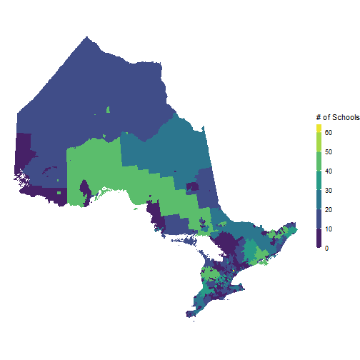

<!-- README.md is generated from README.Rmd. Please edit that file -->

# clccommunities

<!-- badges: start -->
<!-- badges: end -->

The goal of clccommunities is to …

## Installation

You can install the latest version of the `clccommunities` package from
[GitHub](https://github.com).

``` r
# Run this line once to install the devtools package
# install.packages("devtools") 

# Run this line once to install or update the clccommunities package
devtools::install_github("context-dependent/clccommunities")
```

## Define Low Income and Rural Communities in Existing Data

``` r
library(tidyverse)
#> -- Attaching packages --------------------------------------- tidyverse 1.3.0 --
#> v ggplot2 3.3.3     v purrr   0.3.4
#> v tibble  3.1.1     v dplyr   1.0.6
#> v tidyr   1.1.3     v stringr 1.4.0
#> v readr   1.3.1     v forcats 0.5.0
#> Warning: package 'tibble' was built under R version 4.0.5
#> Warning: package 'tidyr' was built under R version 4.0.5
#> Warning: package 'dplyr' was built under R version 4.0.5
#> -- Conflicts ------------------------------------------ tidyverse_conflicts() --
#> x dplyr::filter() masks stats::filter()
#> x dplyr::lag()    masks stats::lag()
library(clccommunities)
## basic example code

ontario_schools_plus <- ontario_schools %>% 
  
  mutate(
    clc_low_income = clc_calculate_low_income(postal_code), 
    clc_rural = clc_calculate_rural(postal_code)
  )

ontario_schools_plus %>% 
  count(clc_low_income) %>% 
  knitr::kable()
```

| clc\_low\_income                         |    n |
|:-----------------------------------------|-----:|
| Low Income (LIM-AT prev. = 19.3%)        | 1252 |
| Not Low Income (LIM-AT prev. &lt; 19.3%) | 4598 |
| (Missing)                                |   22 |

``` r
ontario_schools_plus %>% 
  count(clc_rural) %>% 
  knitr::kable()
```

| clc\_rural             |    n |
|:-----------------------|-----:|
| Not Rural (SAC &lt; 4) | 5135 |
| Rural (SAC = 4)        |  715 |
| (Missing)              |   22 |

## Add All Columns from the Reference Dataset to Existing Data

``` r
library(tidyverse)
library(clccommunities)

ontario_schools_community_data <- add_community_data(ontario_schools, postal_code)

# Run this once to install the skimr package (not necessary, but helpful in general)
# install.packages("skimr")

skimr::skim_without_charts(ontario_schools_community_data)
```

|                                                  |                              |
|:-------------------------------------------------|:-----------------------------|
| Name                                             | ontario\_schools\_community… |
| Number of rows                                   | 5872                         |
| Number of columns                                | 32                           |
| \_\_\_\_\_\_\_\_\_\_\_\_\_\_\_\_\_\_\_\_\_\_\_   |                              |
| Column type frequency:                           |                              |
| character                                        | 27                           |
| numeric                                          | 5                            |
| \_\_\_\_\_\_\_\_\_\_\_\_\_\_\_\_\_\_\_\_\_\_\_\_ |                              |
| Group variables                                  | None                         |

Data summary

**Variable type: character**

| skim\_variable              | n\_missing | complete\_rate | min | max | empty | n\_unique | whitespace |
|:----------------------------|-----------:|---------------:|----:|----:|------:|----------:|-----------:|
| region                      |          0 |           1.00 |  11 |  14 |     0 |         5 |          0 |
| board\_number               |          0 |           1.00 |   6 |   6 |     0 |        85 |          0 |
| board\_name                 |          0 |           1.00 |   7 |  56 |     0 |        85 |          0 |
| board\_type                 |          0 |           1.00 |  10 |  27 |     0 |         8 |          0 |
| board\_language             |          0 |           1.00 |   6 |   7 |     0 |         2 |          0 |
| school\_number              |          0 |           1.00 |   6 |   6 |     0 |      5872 |          0 |
| school\_name                |          0 |           1.00 |   4 |  82 |     0 |      5327 |          0 |
| school\_level               |          0 |           1.00 |   8 |  10 |     0 |         3 |          0 |
| school\_language            |          0 |           1.00 |   6 |   7 |     0 |         2 |          0 |
| school\_type                |          0 |           1.00 |   6 |  19 |     0 |         6 |          0 |
| school\_special\_conditions |          0 |           1.00 |   4 |  32 |     0 |        14 |          0 |
| suite                       |       5729 |           0.02 |   1 |  40 |     0 |       121 |          0 |
| po\_box                     |       5736 |           0.02 |   2 |  16 |     0 |       109 |          0 |
| street                      |          5 |           1.00 |   1 |  47 |     0 |      5201 |          0 |
| city                        |          8 |           1.00 |   3 |  19 |     0 |       759 |          0 |
| province                    |          4 |           1.00 |   7 |   7 |     0 |         1 |          0 |
| postal\_code                |         13 |           1.00 |   6 |   6 |     0 |      4404 |          0 |
| phone                       |        441 |           0.92 |  12 |  12 |     0 |      4839 |          0 |
| fax                         |        905 |           0.85 |  12 |  12 |     0 |      4510 |          0 |
| grade\_range                |          0 |           1.00 |   3 |  20 |     0 |        24 |          0 |
| date\_open                  |          0 |           1.00 |  18 |  18 |     0 |       399 |          0 |
| email                       |       2590 |           0.56 |  11 |  50 |     0 |      3057 |          0 |
| website                     |        921 |           0.84 |   7 | 113 |     0 |      4610 |          0 |
| board\_website              |          1 |           1.00 |   8 |  63 |     0 |        84 |          0 |
| fsa                         |         13 |           1.00 |   3 |   3 |     0 |       495 |          0 |
| clc\_rural\_label           |         22 |           1.00 |   5 |   9 |     0 |         2 |          0 |
| clc\_low\_income\_label     |         22 |           1.00 |  10 |  14 |     0 |         2 |          0 |

**Variable type: numeric**

| skim\_variable              | n\_missing | complete\_rate |     mean |       sd |     p0 |     p25 |      p50 |      p75 |      p100 |
|:----------------------------|-----------:|---------------:|---------:|---------:|-------:|--------:|---------:|---------:|----------:|
| population\_2016            |         22 |              1 | 37491.18 | 22444.44 | 671.00 | 21653.0 | 32345.00 | 46943.00 | 111372.00 |
| lim\_at\_prevalence         |         22 |              1 |     0.15 |     0.07 |   0.03 |     0.1 |     0.14 |     0.18 |      0.48 |
| sac\_rural\_category        |         22 |              1 |     1.68 |     1.36 |   1.00 |     1.0 |     1.00 |     1.00 |      6.00 |
| clc\_rural\_indicator       |         22 |              1 |     0.12 |     0.33 |   0.00 |     0.0 |     0.00 |     0.00 |      1.00 |
| clc\_low\_income\_indicator |         22 |              1 |     0.21 |     0.41 |   0.00 |     0.0 |     0.00 |     0.00 |      1.00 |

## Making a Simple Choropleth

FSA polygons are available in the `fsa_shp` package data.

``` r
# Run this once to install the sf ('Simple Features') package, 
# which makes complex spatial operations relatively straightforward.
# install.packages(sf)

library(sf)
#> Warning: package 'sf' was built under R version 4.0.5
#> Linking to GEOS 3.9.0, GDAL 3.2.1, PROJ 7.2.1
library(tidyverse)
library(clccommunities)

schools_per_fsa <- ontario_schools %>% 
  
  add_community_data(postal_code) %>% 
  group_by(fsa) %>% 
  summarize(
    n_schools = n()
  )

schools_per_fsa_shp <- fsa_shp %>% 
  
  left_join(fsa_data, by = "fsa") %>% 
  filter(province == "Ontario") %>% 
  left_join(schools_per_fsa, by = "fsa") %>% 
  mutate(
    n_schools = coalesce(n_schools, 0)
  )

n_schools_range <- range(schools_per_fsa_shp$n_schools)

schools_per_fsa_shp %>% 
  
  ggplot() + 
  geom_sf(aes(fill = n_schools), colour = NA) + 
  scale_fill_viridis_b(
    guide = guide_colorbar(
      title = "# of Schools", 
      barheight = 12, 
      barwidth = 0.5
    ), 
    breaks = seq(0, 65, by = 10)
  ) + 
  theme_void() 
```



## Data Sources

[June 2021 Ontario Public School Address
File](https://data.ontario.ca/dataset/ontario-public-school-contact-information)
provided by the Government of Ontario.
